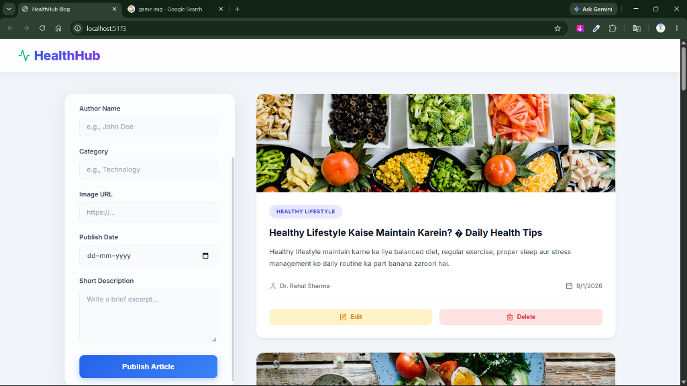
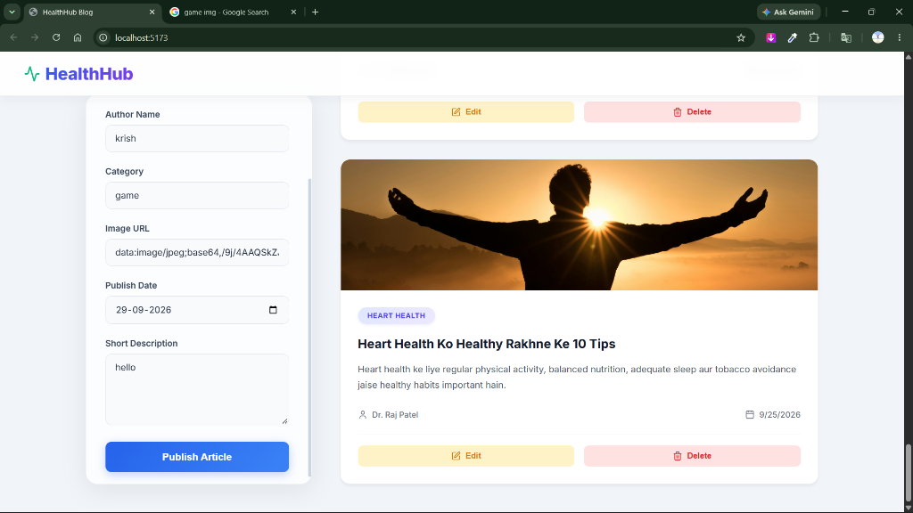
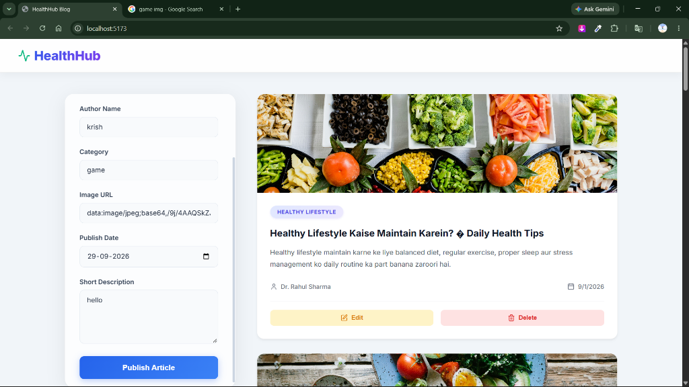
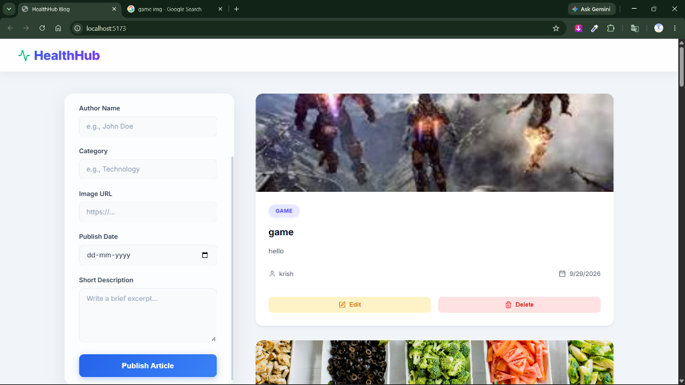

# ✍️ Modern Blog Application

<div align="center">
  
  
  
  
</div>

<br />

Welcome to the **Modern Blog Application**! This is a beautifully designed, responsive, and fully functional single-page blog management platform built with React, Vite, and Framer Motion. 

It allows users to seamlessly create, edit, view, and delete blog articles using browser `localStorage` as a fast, offline-first database.

---

## 📸 Output / Screenshots

Here is a glimpse of how the beautiful UI looks in action:

<div align="center">
  
  
  <br/>
  
  
</div>

---

## 🎥 Video

Watch the full working demo of the application here:

**[👉 https://drive.google.com/file/d/1QE5HO0A_pCxLUmttokSUGQWksJ9Ocjyz/view?usp=sharing ]

---

## ✨ Features

- **🚀 Blazing Fast:** Built on top of Vite and React.
- **💾 Local Storage DB:** No server required! All blog posts are saved securely in your browser's local storage.
- **🎨 Modern UI/UX:** Features a glassmorphism design, smooth backgrounds, and clean typography.
- **✨ Smooth Animations:** Integrated with **Framer Motion** for buttery smooth page loads, list rendering, and interactive state transitions.
- **📱 Fully Responsive:** Works perfectly on desktops, tablets, and mobile devices.
- **📝 Complete CRUD Operations:** 
  - **Create:** Publish new articles with images, dates, and author details.
  - **Read:** Beautiful reading view.
  - **Update:** Edit existing articles smoothly.
  - **Delete:** One-click removal of outdated articles.

---

## 🛠️ Tech Stack

- **Frontend Framework:** React 19
- **Build Tool:** Vite
- **Styling:** Custom CSS (Flex/Grid Layouts, Glassmorphism)
- **Icons:** Lucide React
- **Animations:** Framer Motion

---

## 🚀 Getting Started

Follow these steps to run this project locally on your machine.

### 1. Prerequisites
Make sure you have Node.js installed on your computer.

### 2. Installation
Install all required dependencies by running:
```bash
npm install
```

### 3. Run the Development Server
Start the Vite development server:
```bash
npm run dev
```

### 4. Build for Production
To generate a production-ready optimized build:
```bash
npm run build
```

---

## 📂 Project File Structure

```text
📦 Modern Blog Application
 ┣ 📂 public
 ┃ ┗ 📂 screenshots
 ┃ ┃ ┣ 📜 screenshot1.png
 ┃ ┃ ┣ 📜 screenshot2.png
 ┃ ┃ ┣ 📜 screenshot3.png
 ┃ ┃ ┗ 📜 screenshot4.png
 ┣ 📂 src
 ┃ ┣ 📂 components
 ┃ ┃ ┣ 📜 BlogCard.jsx
 ┃ ┃ ┣ 📜 BlogForm.jsx
 ┃ ┃ ┗ 📜 Navbar.jsx
 ┃ ┣ 📜 App.css
 ┃ ┣ 📜 App.jsx
 ┃ ┣ 📜 data.js
 ┃ ┣ 📜 index.css
 ┃ ┗ 📜 main.jsx
 ┣ 📜 .gitignore
 ┣ 📜 .oxlintrc.json
 ┣ 📜 db.json
 ┣ 📜 index.html
 ┣ 📜 package-lock.json
 ┣ 📜 package.json
 ┣ 📜 README.md
 ┗ 📜 vite.config.js
```

---

## 👨‍💻 Author

Developed with ❤️ by **Krish Virpariya**

---
"# blog" 
